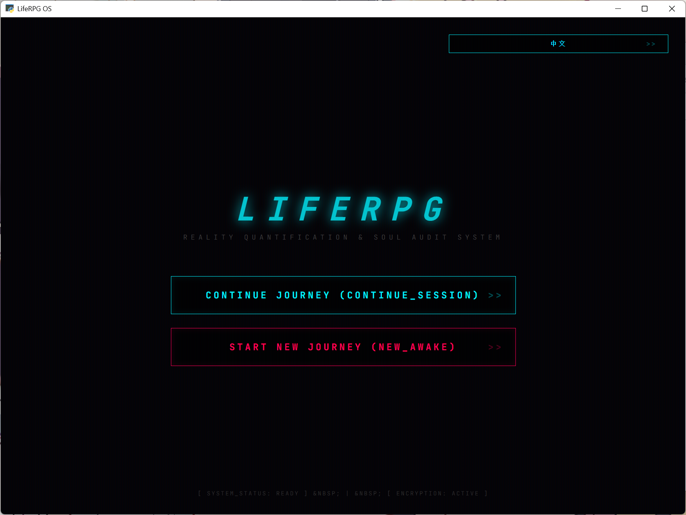
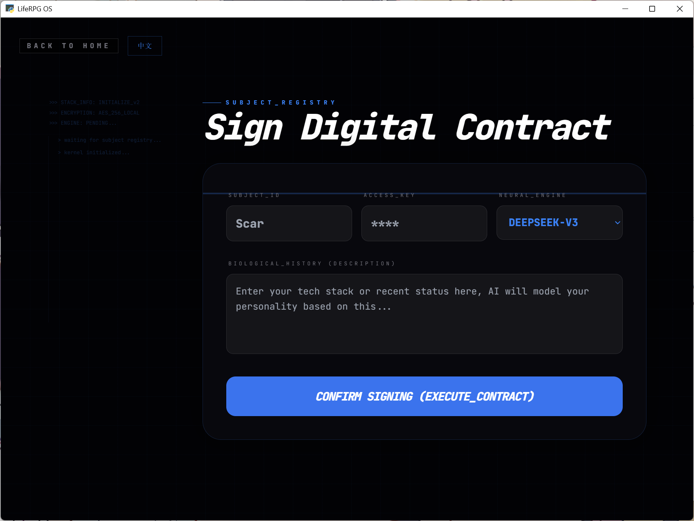
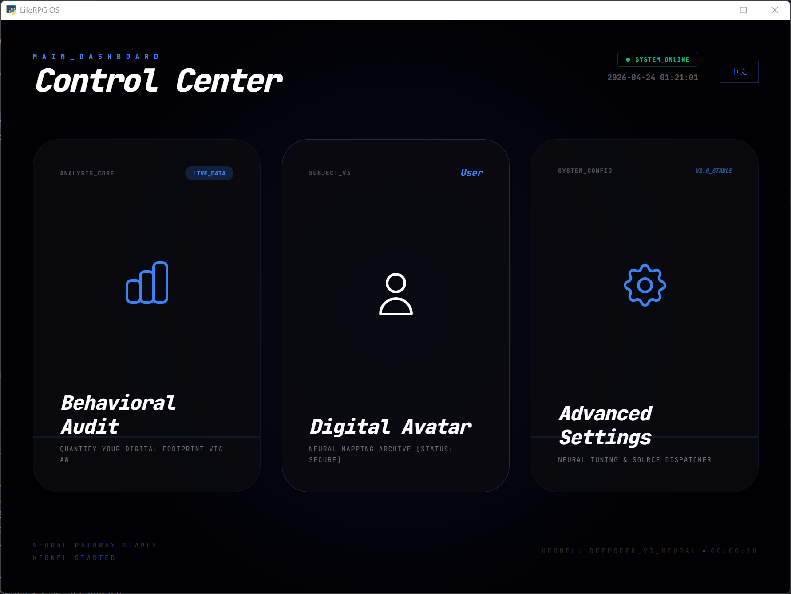
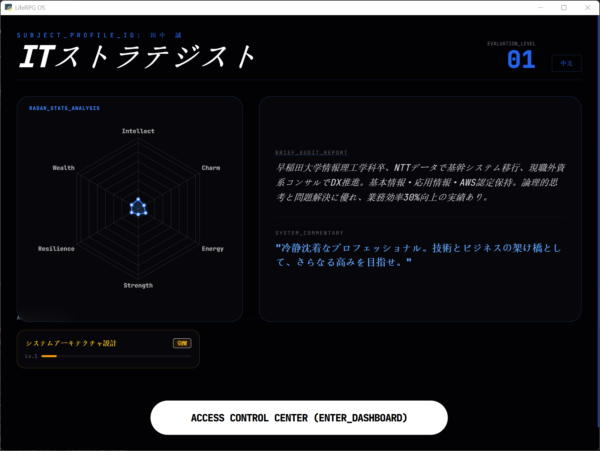
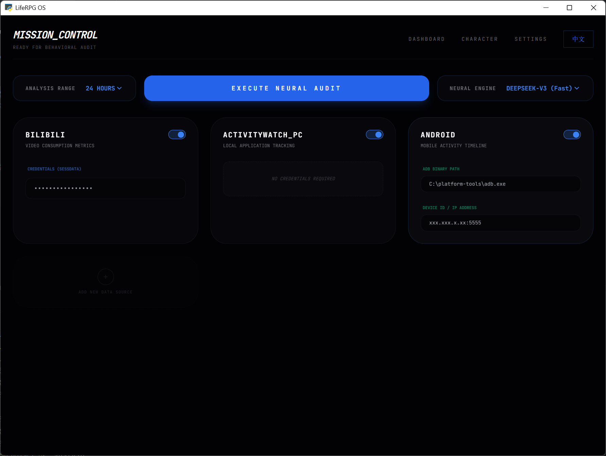
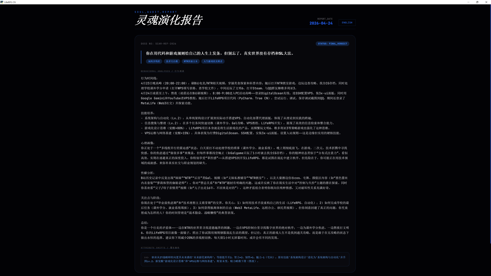
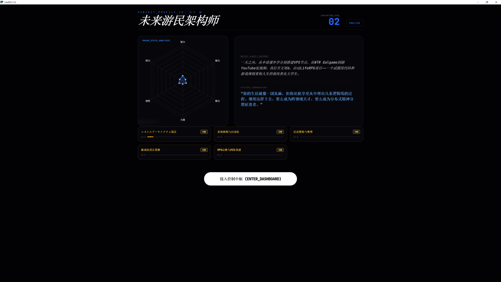

# LifeRPG - Reality Quantification & Soul Audit System

## 项目介绍 | Project Introduction

LifeRPG 是一个创新的个人行为分析与数字化身系统，它将现实生活中的行为数据转化为游戏化的角色属性，通过 AI 分析帮助用户了解自己的行为模式并促进个人成长。

LifeRPG is an innovative personal behavior analysis and digital avatar system that transforms real-life behavior data into game-like character attributes, helping users understand their behavior patterns and promote personal growth through AI analysis.

### 核心功能 | Core Features

- **数字化身创建**：根据用户描述生成个性化的数字化身，包含职业、技能和属性
- **行为审计**：通过 ActivityWatch 和 Bilibili 等数据源分析用户行为
- **灵魂演化**：基于行为数据，AI 会分析并更新角色属性和技能
- **数据可视化**：通过雷达图等方式直观展示角色属性
- **多平台支持**：支持 PC 和 Android 设备的数据采集

- **Digital Avatar Creation**: Generate personalized digital avatars with professions, skills, and attributes based on user descriptions
- **Behavioral Audit**: Analyze user behavior through data sources like ActivityWatch and Bilibili
- **Soul Evolution**: AI analyzes and updates character attributes and skills based on behavior data
- **Data Visualization**: Intuitively display character attributes through radar charts and other methods
- **Multi-platform Support**: Supports data collection from PC and Android devices

## 技术栈 | Technology Stack

- **前端**：HTML5, CSS3, JavaScript, Tailwind CSS, Chart.js
- **后端**：Python, PyWebView
- **数据库**：SQLite
- **AI 模型**：DeepSeek, Qwen
- **数据采集**：ActivityWatch, Bilibili API, Android ADB

- **Frontend**: HTML5, CSS3, JavaScript, Tailwind CSS, Chart.js
- **Backend**: Python, PyWebView
- **Database**: SQLite
- **AI Models**: DeepSeek, Qwen
- **Data Collection**: ActivityWatch, Bilibili API, Android ADB

## 安装与运行 | Installation and Run

### 系统要求 | System Requirements

- Windows 10/11
- Python 3.12+
- ActivityWatch (可选，用于 PC 行为分析) | (optional, for PC behavior analysis)
- Android 设备 (可选，用于移动行为分析) | (optional, for mobile behavior analysis)

### 安装步骤 | Installation Steps

1. **克隆项目** | **Clone Project**
   ```bash
   git clone <repository-url>
   cd LifeRPG-Desktop_test
   ```

2. **创建 .env 文件** | **Create .env File**
   - 在项目根目录创建 `.env` 文件
   - Add the following content to the `.env` file:
   ```
   # AI API Configuration
   DEEPSEEK_API_KEY=your_deepseek_api_key
   DASHSCOPE_API_KEY=your_qwen_api_key
   ```
   - 替换 `your_deepseek_api_key` 和 `your_qwen_api_key` 为你的实际 API 密钥
   - Replace `your_deepseek_api_key` and `your_qwen_api_key` with your actual API keys

3. **安装依赖** | **Install Dependencies**
   ```bash
   pip install -r requirements.txt
   ```

4. **运行应用** | **Run Application**
   ```bash
   python main.py
   ```

## 应用截图 | Application Screenshots

### 主界面 | Main Interface


### 初始化页面 | Initialization Page


### 控制中枢 | Control Center


### 数字化身 | Digital Avatar


### 行为审计 | Behavioral Audit


### 审计报告 | Audit Report


### 审计后的数字化身 | Digital Avatar After Audit


## 使用指南 | User Guide

### 1. 创建数字化身 | Create Digital Avatar

1. 打开应用，点击「开启新旅程」 | Open the application and click "开启新旅程 (NEW_AWAKE)"
2. 输入你的代号、密码和个人描述 | Enter your code name, password, and personal description
3. 选择 AI 模型（DeepSeek 或 Qwen） | Select AI model (DeepSeek or Qwen)
4. 等待 AI 生成你的数字化身 | Wait for AI to generate your digital avatar

### 2. 行为审计 | Behavioral Audit

1. 在控制中枢点击「行为审计」 | Click "行为审计 (ANALYSIS_CORE)" in the control center
2. 选择分析范围（1天、3天或7天） | Select analysis range (1 day, 3 days, or 7 days)
3. 选择数据来源： | Select data sources:
   - **Bilibili**：输入 SESSDATA 以分析视频观看历史 | Enter SESSDATA to analyze video viewing history
   - **ActivityWatch**：自动分析 PC 使用情况 | Automatically analyze PC usage
   - **Android**：输入 ADB 路径和设备 ID 以分析移动设备使用情况 | Enter ADB path and device ID to analyze mobile device usage
4. 选择 AI 模型，点击「Execute Neural Audit」 | Select AI model and click "Execute Neural Audit"
5. 等待审计完成，查看灵魂演化报告 | Wait for the audit to complete and view the soul evolution report

### 3. 查看数字化身 | View Digital Avatar

1. 在控制中枢点击「数字化身」 | Click "数字化身 (SUBJECT_V3)" in the control center
2. 查看你的角色属性、技能和状态 | View your character attributes, skills, and status
3. 查看雷达图展示的六维属性 | View the six-dimensional attributes displayed in the radar chart

### 4. 系统设置 | System Settings

1. 在控制中枢点击「高级设置」 | Click "高级设置 (SYSTEM_CONFIG)" in the control center
2. 可以重置密码或删除账户 | You can reset your password or delete your account

## 数据安全 | Data Security

- 所有数据存储在本地 SQLite 数据库中 | All data is stored in a local SQLite database
- Bilibili SESSDATA 仅用于数据采集，不会被存储 | Bilibili SESSDATA is only used for data collection and will not be stored
- Android 设备 ID 仅用于数据采集，不会被存储 | Android device ID is only used for data collection and will not be stored

## 项目结构 | Project Structure

```
LifeRPG-Desktop_test/
├── src/
│   ├── web/              # 前端页面 | Frontend pages
│   │   ├── index.html     # 入口页面 | Entry page
│   │   ├── login.html     # 登录页面 | Login page
│   │   ├── initialize.html # 初始化页面 | Initialization page
│   │   ├── dashboard.html # 控制中枢 | Control center
│   │   ├── character.html # 数字化身页面 | Digital avatar page
│   │   ├── analyze.html   # 行为审计页面 | Behavioral audit page
│   │   ├── analyze_detail.html # 审计报告页面 | Audit report page
│   │   └── settings.html  # 设置页面 | Settings page
│   ├── database/          # 数据库相关 | Database related
│   ├── utils/             # 工具类 | Utility classes
│   └── core/              # 核心功能 | Core functions
│       └── scrapers/      # 数据采集模块 | Data collection modules
├── main.py                # 主应用入口 | Main application entry
├── LifeRPG-OS.spec        # PyInstaller 配置 | PyInstaller configuration
├── .env                   # 环境变量配置 | Environment variable configuration
└── requirements.txt       # 依赖文件 | Dependency file
```

## 常见问题 | Frequently Asked Questions

### Q: 行为审计失败怎么办？ | Q: What if behavioral audit fails?

A: 请检查以下几点： | A: Please check the following:
- Bilibili SESSDATA 是否有效 | Is Bilibili SESSDATA valid
- ActivityWatch 是否正在运行 | Is ActivityWatch running
- Android 设备是否已连接并开启 USB 调试 | Is Android device connected and USB debugging enabled

### Q: 数字化身属性如何计算？ | Q: How are digital avatar attributes calculated?

A: 数字化身的属性基于你提供的个人描述和行为数据，由 AI 模型分析生成。 | A: Digital avatar attributes are generated by AI models based on your personal description and behavior data.

### Q: 可以使用哪些 AI 模型？ | Q: What AI models can be used?

A: 目前支持 DeepSeek 和 Qwen 模型，你可以在初始化和审计时选择。 | A: Currently, DeepSeek and Qwen models are supported, which you can choose during initialization and audit.

## 未来计划 | Future Plans

- [ ] 添加更多数据来源 | Add more data sources
- [ ] 增强 AI 分析能力 | Enhance AI analysis capabilities
- [ ] 添加社交功能 | Add social features
- [ ] 支持更多平台 | Support more platforms
- [ ] 提供更丰富的可视化效果 | Provide richer visualization effects

## 贡献 | Contribution

欢迎提交 Issue 和 Pull Request 来改进这个项目！ | Welcome to submit Issues and Pull Requests to improve this project!

## 许可证 | License

本项目采用 MIT 许可证。 | This project is licensed under the MIT License.

---

**LifeRPG - 让生活更有意义** | **LifeRPG - Make Life More Meaningful**
